# E-Banking Application

## 📝 Description du Projet
Cette application E-Banking est une solution complète de banque en ligne développée avec les technologies modernes. Elle permet aux utilisateurs de gérer leurs comptes bancaires, effectuer des transactions, et suivre leurs activités financières de manière sécurisée.

## 🏗 Architecture du Projet

### Architecture Globale
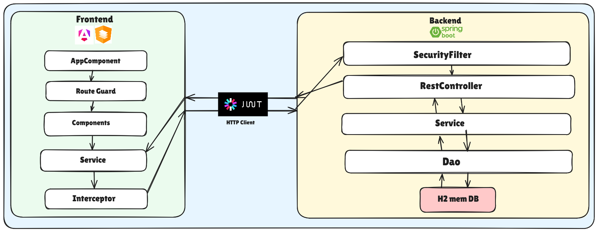

## 📊 Diagrammes de Conception

### Diagramme de Classes
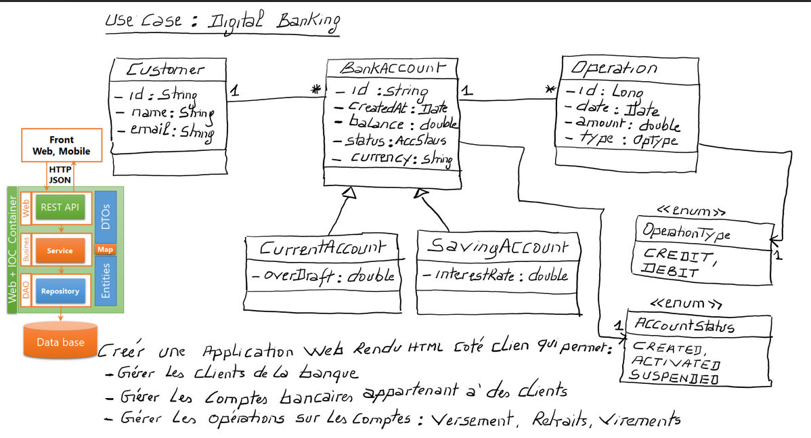

## 🛠 Technologies Utilisées
- **Backend:**
  - Spring Boot
  - Spring Security
  - JWT (JSON Web Token)
  - Spring Data JPA
  - MySQL

- **Frontend:**
  - Angular
  - Angular Material
  - TypeScript
  - HTML5/CSS3
  - Bootstrap

## 📸 Captures d'écran du Projet

### Page de Connexion
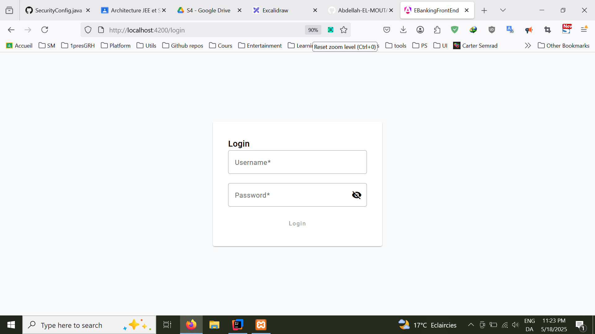

### Tableau de Bord
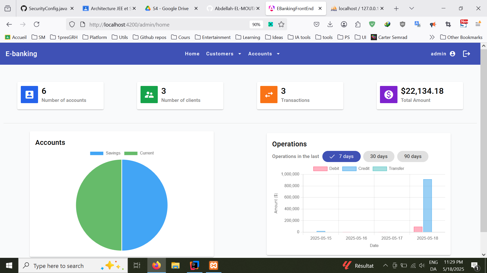

### Gestion des Clients
#### Liste des Clients
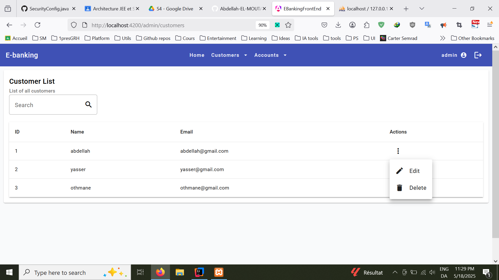

#### Modification d'un Client
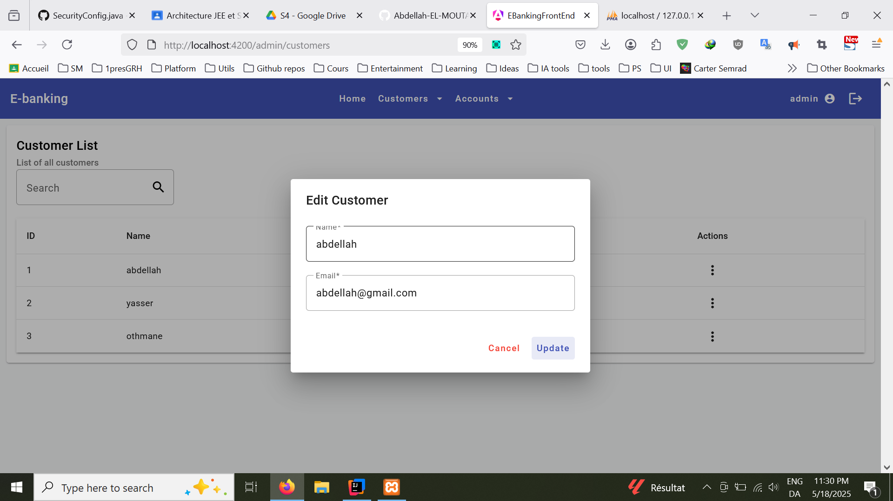

#### Suppression d'un Client
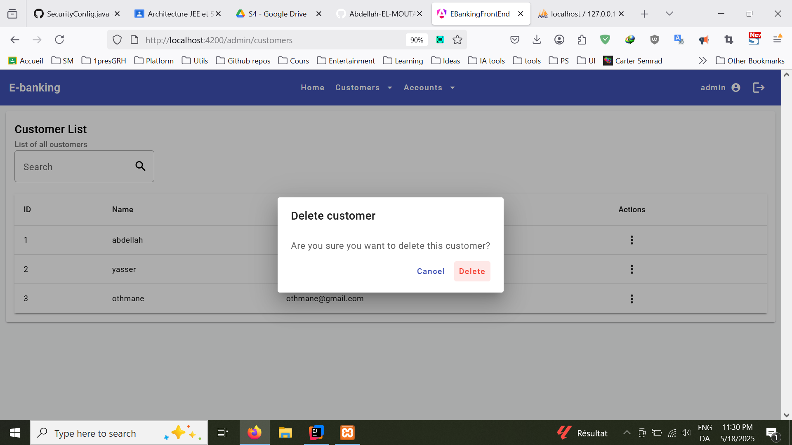

### Gestion des Comptes
#### Liste des Comptes
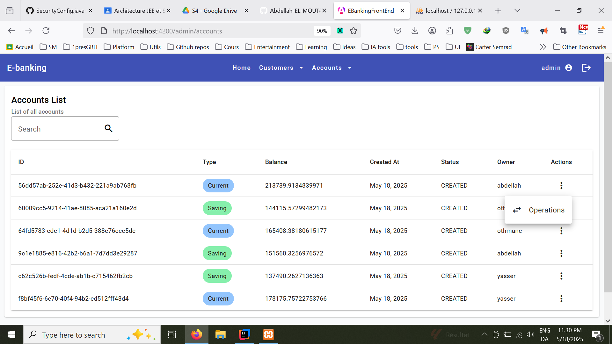

### Gestion des Opérations
#### Liste des Opérations
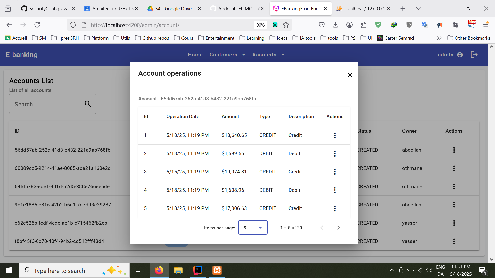

#### Nouvelle Opération
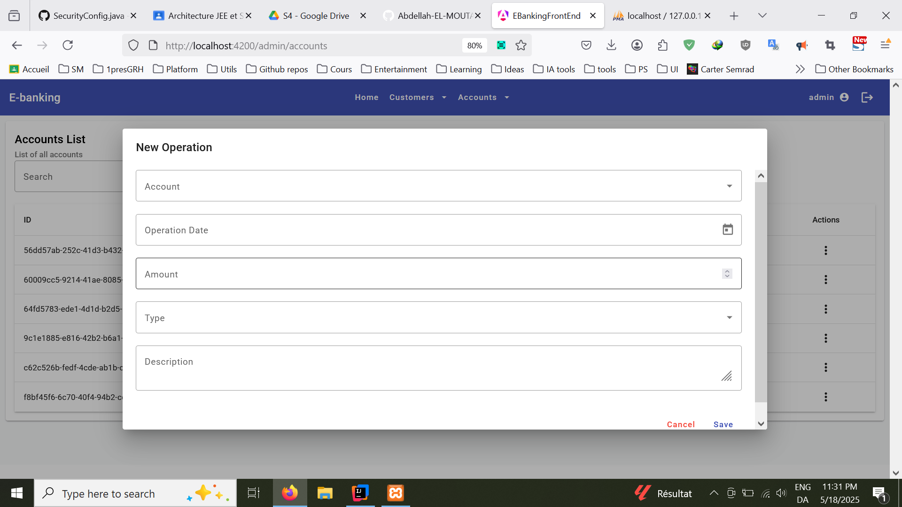

#### Modification d'une Opération
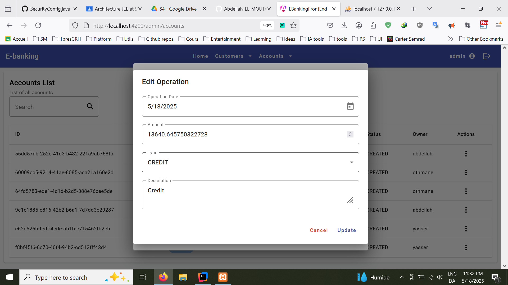

## 🚀 Fonctionnalités Principales
- Authentification sécurisée avec JWT
- Gestion des comptes bancaires
- Virements entre comptes
- Historique des transactions
- Tableau de bord personnalisé
- Gestion du profil utilisateur
- Administration des comptes

## 🔒 Sécurité
- Authentification basée sur JWT
- Autorisation basée sur les rôles
- Validation des données
- Protection contre les attaques CSRF
- Chiffrement des données sensibles

## 🚀 Installation et Déploiement

### Prérequis
- JDK 11 ou supérieur
- Node.js et npm
- MySQL
- Maven

### Installation du Backend
```bash
# Cloner le repository
git clone [url-du-repo]

# Accéder au dossier backend
cd backend

# Installer les dépendances
mvn install

# Démarrer l'application
mvn spring-boot:run
```

### Installation du Frontend
```bash
# Accéder au dossier frontend
cd frontend

# Installer les dépendances
npm install

# Démarrer l'application
ng serve
```

## 📝 Configuration
### Backend (application.properties)
```properties
spring.datasource.url=jdbc:mysql://localhost:3306/ebanking
spring.datasource.username=root
spring.datasource.password=root
spring.jpa.hibernate.ddl-auto=update
```

### Frontend (environment.ts)
```typescript
export const environment = {
  production: false,
  apiUrl: 'http://localhost:8080/api'
};
```